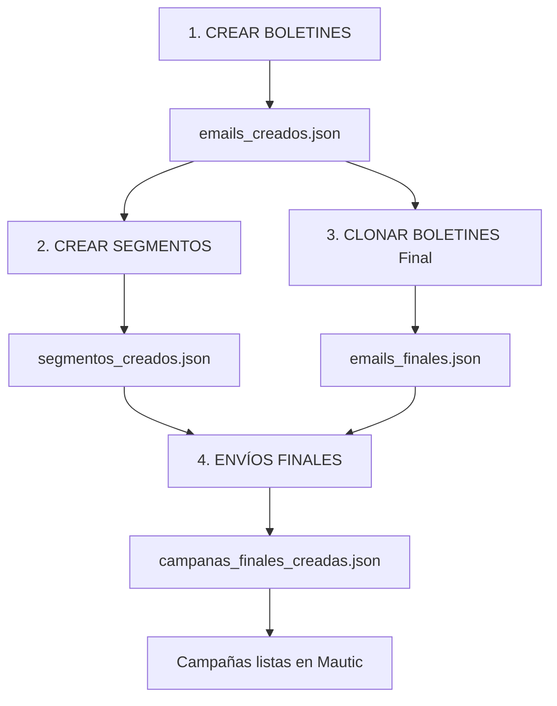

# Envíos Finales - Campañas con Boletines Finales

## Descripción

El botón "ENVÍOS FINALES" permite crear campañas de producción asociando los **boletines finales** (sin PRUEBA) con sus **segmentos correspondientes**.

## Flujo Completo de Producción

### 1. Crear Boletines de Prueba
```
Botón: CREAR BOLETINES
Resultado: emails_creados.json (con PRUEBA- en el nombre)
```

### 2. Crear Segmentos
```
Botón: CREAR SEGMENTOS
Requisito: emails_creados.json
Resultado: segmentos_creados.json
```

### 3. Clonar Boletines (Modo Final)
```
Botón: CLONAR BOLETINES → Seleccionar "Clonación Final"
Requisito: emails_creados.json
Resultado: emails_finales.json (sin PRUEBA en el nombre)
```

### 4. Crear Campañas Finales ⭐ NUEVO
```
Botón: ENVÍOS FINALES
Requisitos: emails_finales.json + segmentos_creados.json
Resultado: campanas_finales_creadas.json
```

## Condiciones para habilitar "ENVÍOS FINALES"

El botón se habilita automáticamente cuando:
- ✅ Existe `emails_finales.json` (boletines clonados sin PRUEBA)
- ✅ Existe `segmentos_creados.json` (segmentos creados)
- ✅ Ambos archivos tienen contenido válido

## Proceso de Asociación

El sistema asocia automáticamente cada boletín final con su segmento mediante:

1. **Establecimiento**: Debe coincidir exactamente
2. **Tipo**: Personal o Corporativo debe coincidir

**Ejemplo de coincidencia**:
```json
Boletín Final:
{
  "name": "CME-BOL-INF-MME-PERSONAL_MAMIT_12ENERO26",
  "establishment": "MamiT",
  "type": "personal",
  "id": "3151"
}

Segmento:
{
  "name": "CME-BOL-INF-MME-PERSONAL_MAMIT_12ENERO26",
  "establishment": "MamiT",
  "type": "personal"
}

✅ COINCIDENCIA: Se crea la campaña asociando email 3151 con el segmento
```

## Archivo generado: campanas_finales_creadas.json

### Estructura
```json
[
  {
    "name": "Nombre de la campaña (igual al boletín final)",
    "email_id": "ID del boletín en Mautic",
    "segment_name": "Nombre del segmento asociado",
    "establishment": "Nombre del establecimiento",
    "type": "personal o corporate",
    "created_at": "Timestamp ISO 8601"
  }
]
```

### Ejemplo completo
Ver `campanas_finales_creadas_ejemplo.json`

## Casos de uso

Este archivo es útil para:

1. **Auditoría**: Registro de qué campañas se enviaron y cuándo
2. **Trazabilidad**: Saber qué email fue enviado a qué segmento
3. **Reportes**: Generar informes de envíos realizados
4. **Verificación**: Confirmar que todas las campañas se crearon correctamente
5. **Rollback**: Tener registro para deshacer si es necesario

## Proceso en Mautic

Cuando se ejecuta "ENVÍOS FINALES", el sistema:

1. **Carga archivos**: Lee emails_finales.json y segmentos_creados.json
2. **Mapeo**: Crea un mapa de segmentos por establecimiento+tipo
3. **Login**: Se conecta a Mautic
4. **Por cada boletín final**:
   - Busca su segmento correspondiente
   - Crea una campaña en Mautic
   - Asocia el email con el segmento
   - Configura envío inmediato
   - Guarda y publica
5. **Resultado**: Guarda campanas_finales_creadas.json

## Ventajas vs CREAR CAMPAÑAS

| Característica | CREAR CAMPAÑAS | ENVÍOS FINALES |
|----------------|----------------|----------------|
| Boletines | Con PRUEBA- | Sin PRUEBA (finales) |
| Propósito | Testing | Producción |
| Segmento | Segmento-DV (prueba) | Segmentos específicos |
| JSON generado | No genera JSON | campanas_finales_creadas.json |
| Asociación | Manual | Automática por establecimiento+tipo |

## Errores comunes

### "Sin boletines finales"
**Causa**: No existe emails_finales.json
**Solución**: Ejecuta CLONAR BOLETINES en modo "Clonación Final"

### "Sin segmentos"
**Causa**: No existe segmentos_creados.json
**Solución**: Ejecuta CREAR SEGMENTOS primero

### "No se encontró segmento para X"
**Causa**: No hay segmento que coincida con el establecimiento y tipo del boletín
**Solución**: Verifica que se crearon segmentos para todos los establecimientos

### Botón deshabilitado
**Causa**: Faltan archivos o están vacíos
**Solución**:
1. Verifica que existan emails_finales.json y segmentos_creados.json
2. Reinicia la aplicación para re-verificar
3. Revisa el log para mensajes de error

## Notas importantes

- El archivo se **sobreescribe** cada vez que ejecutas "ENVÍOS FINALES"
- Si necesitas mantener historial, renombra el archivo antes de crear nuevas campañas
- Las campañas creadas quedan **listas para envío** en Mautic
- **No se envían automáticamente**, debes activarlas manualmente en Mautic
- El archivo está en `.gitignore` para no subirlo al repositorio

## Orden recomendado de operaciones



## Tips

- ✅ Ejecuta el proceso completo en ambiente de prueba primero
- ✅ Verifica los segmentos en Mautic antes de crear campañas
- ✅ Revisa el log en cada paso para detectar errores temprano
- ✅ Guarda copias de los JSON antes de operaciones importantes
- ✅ Verifica las campañas en Mautic antes de activarlas
